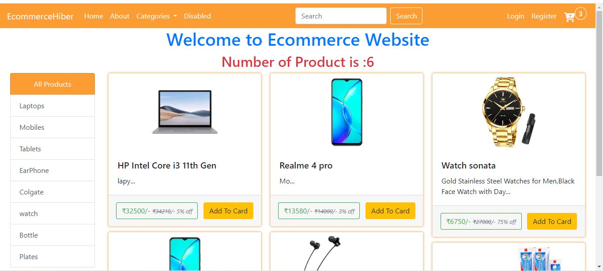
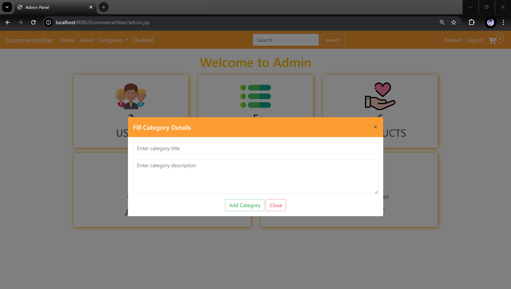
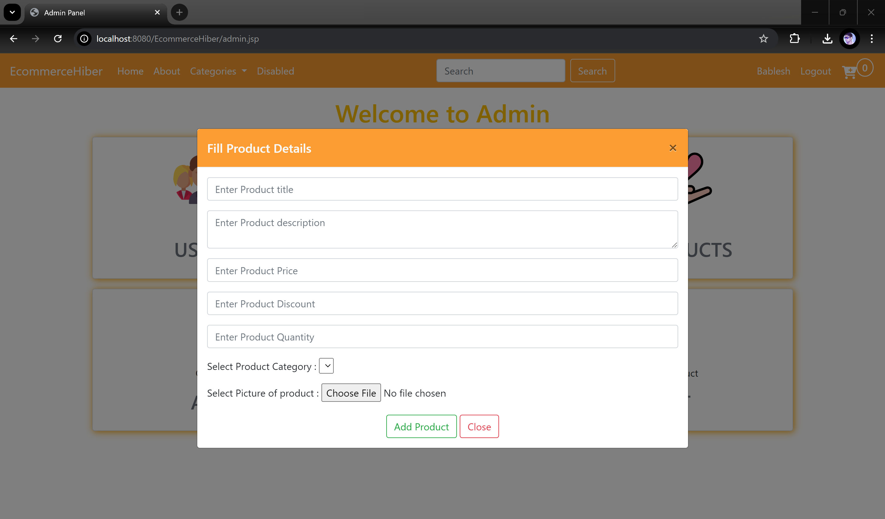
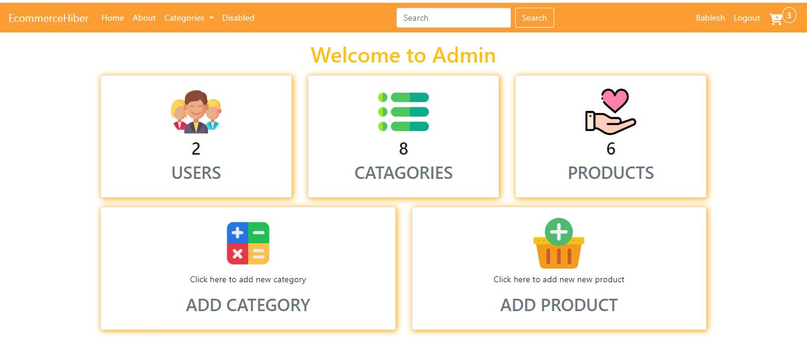
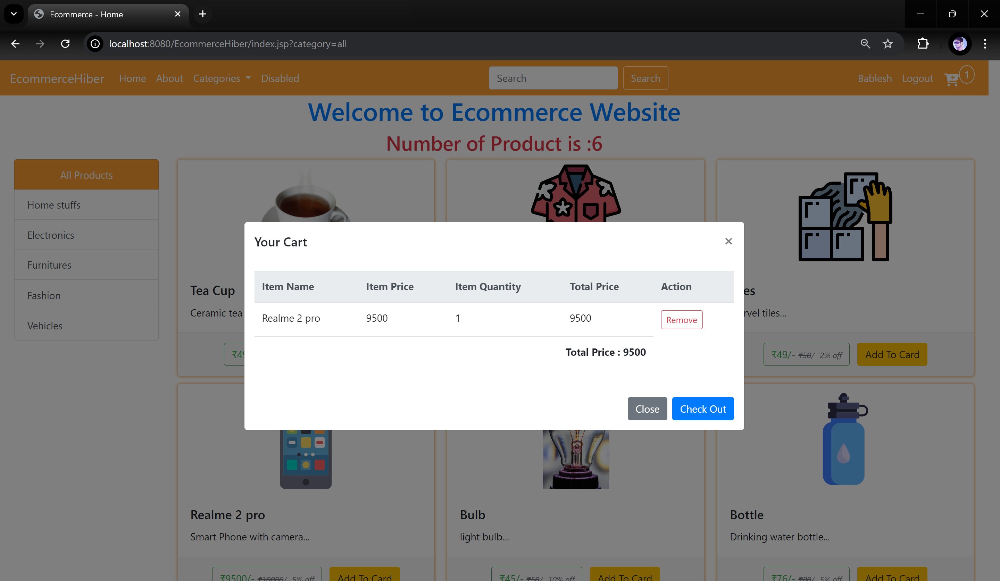
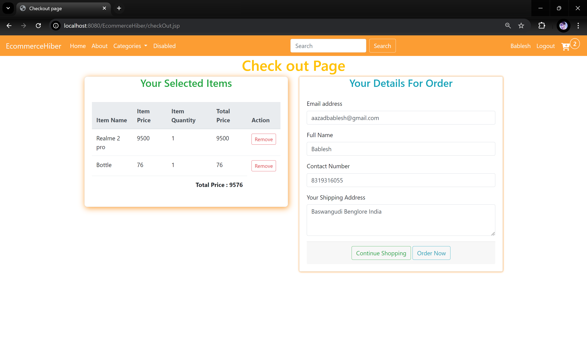
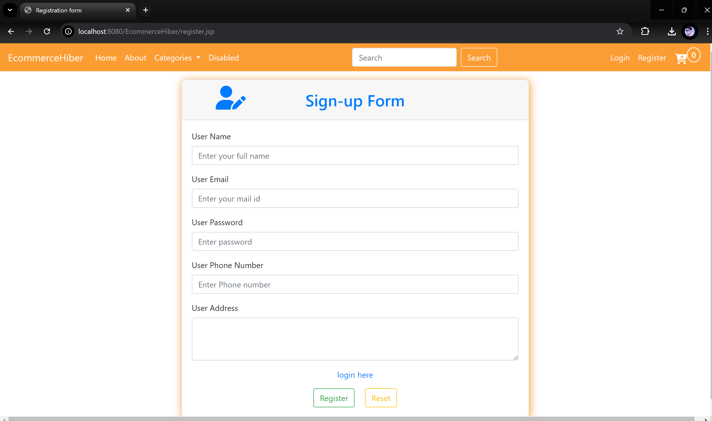

## 🛒🛍️ Ecommerce Shopping App Using JSP

This project is a small demo of an ecommerce shopping application using JSP and Hibernate. It demonstrates the basic working principles of an ecommerce shopping platform.

**🏠 Features:**

**For 😁 Customers:**
- Filter, view products, and place orders.

**For ‍🏫 Admin:**
- Allow sellers to add products and product categories.
- View all users, products, categories, etc.

---

**🧑‍💻 Technologies Used:**

`Hibernate` `JSP` `MySQL` `Servlet` `JQuery` `Bootstrap` `CSS` `JavaScript`

---

**💻 How To Use the Source Code:**

1. Download the master branch as a zip file.
2. Import the project into your IDE and ensure JDK 21 is installed.
3. Set up your server. Tomcat Version 9.0 is recommended.
4. A MySQL server is needed for storing data.
5. Run your application using the Tomcat server.

---

#### 📝 Examples of UI

- **Find Products:**

  **Base URL:** `http://localhost:8080/EcommerceHiber/index.jsp`

#### 🧑 Home Page 👲

  

---

#### 🏚️🏪 Admin features 🚛

  
  

   

---
#### 🛍️ Customer features 🛒

  
  

#### 🛍️ Common features 🛒

  
  

